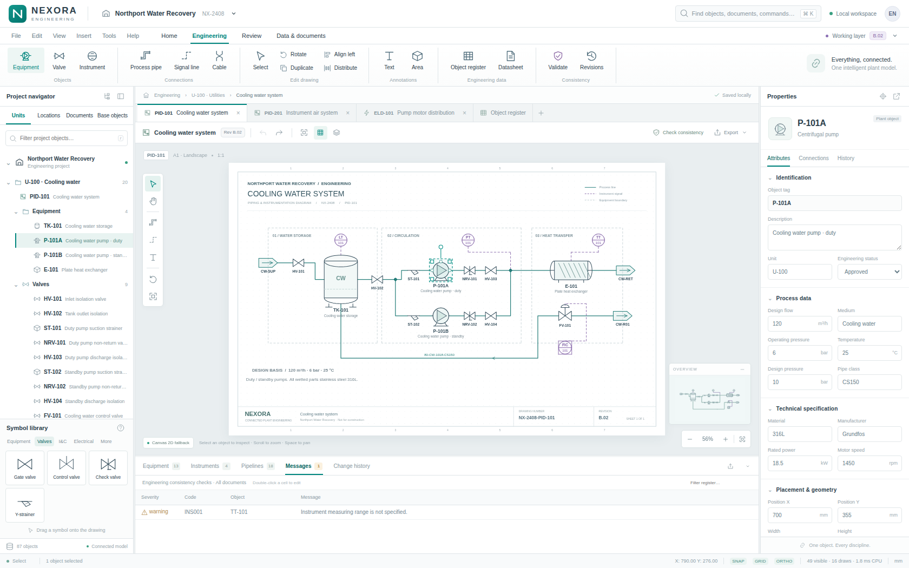

# Nexora Engineering

[Open the application](https://wieslawsoltes.github.io/NexoraEngineering/) · [Download standalone HTML](Nexora-Engineering.html)

**An object-centric plant engineering workbench, built with plain HTML, CSS, JavaScript, and a native WebGPU geometry renderer.**

Version 0.1.0 · Independent implementation · No application dependencies or CDN requests



Nexora combines an editable P&ID/electrical drawing canvas, a project navigator, object properties, engineering registers, consistency checks, and local revision snapshots. These views operate on the same ID-based engineering graph: moving a pump reroutes its attached connections; changing its description in a register updates the navigator and drawing.

The workbench follows familiar COMOS-style engineering workflows without using Siemens branding, source code, or proprietary assets. It is a working, independently implemented foundation, **not a complete COMOS replacement, native COMOS file reader, or certified engineering system**.

## Run

The delivered `Nexora-Engineering.html` is self-contained. Open it directly to try the application; a browser may restrict WebGPU or storage for local files. For a predictable development origin, serve the project directory:

```sh
cd nexora-engineering
python3 -m http.server 8765
```

Open `http://localhost:8765/`. This serves the modular source entry point. To serve the standalone distribution instead:

```sh
python3 -m http.server 8765 --directory dist
```

The rendering badge reports the renderer actually in use. WebGPU requires a suitable browser, a secure context, and an available adapter. HTTPS is recommended for hosting. The app automatically falls back to Canvas 2D when WebGPU is unavailable, fails initialization, or loses its device. Add `?renderer=canvas` to explicitly exercise the fallback.

There is no backend. Projects are stored in the current browser profile when browser storage is available. **Use Export project regularly for a portable backup.** The app reports storage failures rather than claiming a save succeeded.

## Included sample

The fictional Northport Water Recovery project contains **87 engineering objects: 48 nodes and 39 connections across three drawings**.

| Drawing | Content |
|---|---|
| PID-101 | Cooling water storage, duty/standby pumps, isolation/check/control valves, heat exchanger, and instrumentation |
| PID-201 | Instrument-air filtration, compression, receiver, dryer, and pressure measurement |
| ELD-101 | Motor distribution with buses, breakers, terminals, motors, and cable connections |

The seed deliberately leaves TT-101's measuring range empty so the validation workflow has a real issue to inspect and fix. Sample process values, equipment references, and project information are illustrative, not an approved design or supplier specification.

## Editing and data workflows

| Area | Implemented behavior |
|---|---|
| Workbench | Resizable navigator/properties/register docks, ribbon commands, drawing tabs, project searches, command palette, minimap, layer visibility |
| Drawing | Pan, anchored zoom, fit, single/multiple/marquee selection, snapped dragging, resize and rotation handles, symbol placement, annotations, alignment, distribution |
| Connections | Pipe, signal, and cable objects; named equipment ports; automatic orthogonal routing; manual bends; direct-segment routing; endpoint reattachment; live endpoint updates |
| Object data | Shared tags, descriptions, engineering status, geometry, units, and process/electrical attributes; editable register cells and inspector fields |
| History | Transaction rollback, 100-command undo/redo, graph-aware copy/paste, duplication, delete with connection cleanup, 20 local revision snapshots, comparison and undoable restoration |
| Validation | Missing/duplicate tags, free endpoints, disconnected objects, missing pipe diameter and instrument range, pipe-class mismatch, and operating/design pressure comparison |
| Persistence | Ordered IndexedDB project writes, localStorage fallback, debounced autosave, versioned JSON import/export and guarded input projection |
| Output | Project JSON, register CSV, drawing SVG, PNG, basic ASCII DXF R12 geometry, and browser-print drawing/datasheet views |

The library includes 19 symbol types spanning equipment, valves, instrumentation, electrical objects, connections, text, and process areas. Symbols are illustrative engineering graphics; no ISA/IEC/ISO certification or full symbol-standard coverage is claimed.

### A useful first walkthrough

Select P-101A and drag it: connected lines follow its ports. Edit its description in the Properties dock, then inspect the matching equipment-register row. Double-click a register cell to edit it in place. Place a valve from the symbol library, choose the pipe tool, and connect equipment ports. Undo restores the object model, not just the drawing appearance.

Open Messages to inspect the missing range on TT-101. Enter a range such as `0–100 °C` in the instrument's properties, then run validation again. Create a revision snapshot before more edits and use the comparison view to inspect object changes.

### Keyboard and pointer controls

| Control | Action |
|---|---|
| V / H | Select / pan |
| Hold Space + drag, or middle-button drag | Temporary pan |
| Mouse wheel | Zoom around pointer |
| F / G | Fit drawing / toggle grid |
| P / S / C / T | Pipe / signal / cable / text tool |
| R | Rotate selected nodes by 90° |
| Shift-click / drag empty canvas | Extend selection / marquee selection |
| Arrow keys / Shift+Arrow | Nudge / larger nudge |
| Enter while routing | Finish at the current endpoint |
| Escape | Cancel interaction and return to selection |
| Delete / Backspace | Delete selection |
| Ctrl/Cmd+Z / Ctrl/Cmd+Shift+Z | Undo / redo |
| Ctrl/Cmd+C / V / D | Internal graph copy / paste / duplicate |
| Ctrl/Cmd+A | Select document objects |
| Ctrl/Cmd+K | Search commands, objects, and documents |
| Ctrl/Cmd+S / O / P | Save locally / open project / print |

Graph clipboard operations use the application's internal clipboard. They do not depend on browser permission to read the operating-system clipboard.

## Rendering design

`src/renderer.js` contains real WGSL and native WebGPU pipelines. Lines use instanced analytic capsule geometry with anti-aliased coverage; fills use triangle vertices. A nonempty geometry frame uses at most two GPU drawing commands, one for fills and one for stroke instances. CPU-side spatial indexing culls drawing objects, retained geometry avoids reconstructing unchanged symbols, and GPU vertex buffers grow geometrically and are reused.

This is a **hybrid** renderer: labels, sheet decorations, interaction overlays, and the minimap use Canvas 2D. The interface uses HTML/CSS. The fallback batches Canvas strokes by style. Rendering is demand-driven rather than an always-running animation loop. The status timing is CPU wall time for the render work, not a GPU timestamp or a promised frame rate.

See [Architecture](docs/ARCHITECTURE.md) for graph invariants, memory layouts, transaction costs, and extension points.

## Build and tests

Node.js 20+ is used for the dependency-free build and kernel tests. Python is only needed for the optional local server and Playwright integration tests.

```sh
npm test
npm run build
```

`npm run build` regenerates both `Nexora-Engineering.html` and `dist/index.html`. No `npm install` is necessary.

Browser tests are optional development tooling:

```sh
python3 -m pip install playwright
python3 -m playwright install chromium
python3 tests/browser.test.py
```

`CHROMIUM_PATH` can select an installed browser executable. `NEXORA_URL=http://localhost:8765/` switches the workflow suite from injected standalone HTML to a hosted application.

**Recorded verification:** 39 kernel tests and 31 browser workflow checks passed. The captured browser run used Chromium 144 in an opaque-origin environment and exercised the Canvas fallback. It did not verify native WebGPU execution, durable IndexedDB persistence across reload, or the operating-system print dialog. Export checks observed generated download events and filenames, not every completed filesystem write. Detailed results and screenshots are included in `docs/`.

A separate `tests/webgpu.test.py` is provided for a real secure-origin GPU/persistence smoke test. It has **not been run successfully in the delivery environment**. It requires a browser configuration with WebGPU enabled, an actual adapter, and normal origin navigation/storage support; it fails rather than silently accepting Canvas fallback.

## Scope boundaries

This release is a local, single-user engineering workbench. It does not implement native COMOS database/project interchange, COMOS base-object inheritance, 3D plant modelling, hydraulic/electrical simulation, obstacle-avoiding routing, enterprise document management, authenticated approvals, access control, collaboration, or immutable audit history. Its DXF output is geometric LINE/TEXT interchange, not a semantic plant database, and it does not import DXF.

The model currently ties each engineering node to one drawing. References connect ports within the same drawing; this is not yet a separate asset/representation model with one physical asset represented on multiple drawings. The off-page symbol is a drawing object, not a resolved cross-document continuation.

Input collection limits are guardrails, not measured capacity guarantees. Transaction preparation takes whole-graph snapshots before producing sparse undo patches. GPU coordinates use Float32 world positions rather than a large-world floating-origin scheme. These tradeoffs and a hardening roadmap are documented in `docs/ARCHITECTURE.md`.

## Source layout

```text
index.html                    Modular application entry
styles.css                    Workbench layout and design tokens
src/core.js                   Graph, schema, transactions, routing, validation, sample data
src/geometry.js               Symbol geometry, scene cache, spatial picking, SVG/DXF
src/renderer.js               Native WebGPU pipelines and Canvas fallback
src/storage.js                Ordered browser persistence
src/ui.js                     Original icons, symbol previews, escaping, downloads
src/app.js                    Editor controllers and object-backed views
build.mjs                     Dependency-free standalone packaging
examples/northport.nexora.json Portable sample project
examples/graph-api.mjs         Runnable graph/API example
tests/                        Kernel, workflow, and optional GPU smoke tests
docs/                         Architecture, test details, results, screenshots
```

## References

Siemens describes COMOS as object-oriented integrated plant engineering software. Nexora takes inspiration from that workflow, not from proprietary implementation details. Its implementation is original to this delivery.

- Siemens COMOS: https://www.siemens.com/en-us/products/comos/
- Siemens COMOS portfolio: https://www.siemens.com/en-us/products/comos/portfolio/
- W3C WebGPU specification: https://www.w3.org/TR/webgpu/
- GPUWeb API explainer: https://gpuweb.github.io/gpuweb/explainer/

Siemens and COMOS are names belonging to their respective owners. Nexora is not affiliated with or endorsed by Siemens. The included engineering diagrams are fictional and marked not for construction.
